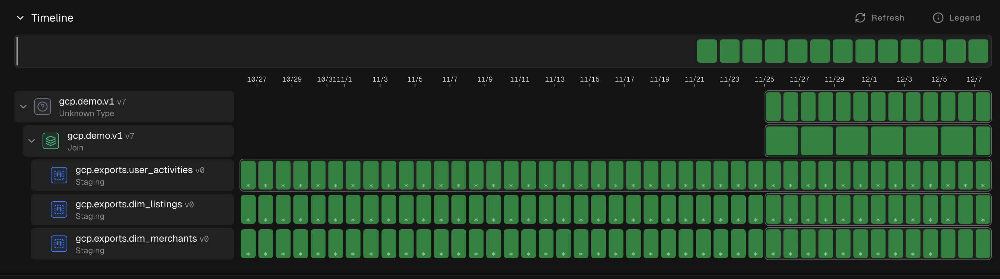
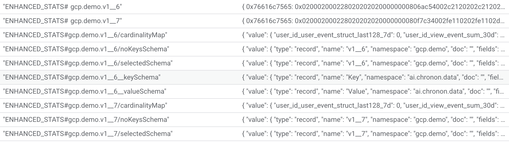

# Enhanced Statistics System - Development Context

This document provides comprehensive context for continuing development of the Enhanced Statistics system in Chronon. Use this as a prompt/reference when picking up this work.

## Quick Start Context

I'm working on the Enhanced Statistics feature in the Chronon codebase. This system computes cardinality-aware statistics on join outputs, stores them as mergeable intermediate representations (IRs) in a KV Store, and provides a REST API to query aggregated statistics across arbitrary time ranges.

## What Was Built

### Core Components (3 Modules)

1. **Spark Module** - Statistics computation and storage
   - `EnhancedStatsCompute`: Detects cardinality and generates appropriate metrics
   - `EnhancedStatsStore`: Uploads/fetches stats to/from KV Store
   - Location: `spark/src/main/scala/ai/chronon/spark/stats/`

2. **Service Module** - REST API for querying statistics
   - `JavaStatsService`: Java-friendly wrapper for fetching stats
   - `StatsHandler`: Vert.x HTTP handler for `/v1/stats/:tableName` endpoint
   - Locations:
     - `online/src/main/scala/ai/chronon/online/JavaStatsService.scala`
     - `service/src/main/java/ai/chronon/service/handlers/StatsHandler.java`

3. **API Module** - Workflow planner integration
   - `JoinStatsComputeNode`: Thrift node for stats computation and KV upload (combined operation)
   - `MonolithJoinPlanner`: Integrated stats node into join workflow
   - Locations:
     - `thrift/planner.thrift`
     - `api/src/main/scala/ai/chronon/api/planner/MonolithJoinPlanner.scala`

## Visual Overview

### Orchestration Flow

The complete orchestration with stats nodes integrated into the workflow:



This shows how the stats compute and upload nodes are positioned in the workflow execution graph.

### KV Store Data Sample

Example of statistics data stored in the KV Store:



The KV Store contains:
- Schema rows for keys and values
- Time-bucketed tiles with normalized IRs
- Metadata for proper decoding

## Key Architecture Concepts

### IR Normalization (CRITICAL CONCEPT)

In Chronon, "normalize" does NOT mean "convert to final statistics". Instead:

```
normalize: IR objects → serializable form (CpcSketch → bytes)
denormalize: serializable form → IR objects (bytes → CpcSketch)
finalize: IR → final statistics (CpcSketch → Long count)
```

**Flow:**
```
Compute IR → normalize → encode to Avro → store in KV
Fetch from KV → decode Avro → denormalize → merge → finalize
```

This is essential for understanding the code in `EnhancedStatsStore.fetch()`.

### Cardinality-Aware Metrics

The system automatically chooses appropriate statistics based on column cardinality:

- **Numeric columns**: Always get full treatment (min, max, avg, variance, percentiles, sketches)
- **Low cardinality (≤100 unique)**: Exact counts, histograms, top-k
- **High cardinality (>100 unique)**: Approximate sketches only

See `StatsGenerator.buildEnhancedMetrics()` in `aggregator/src/main/scala/ai/chronon/aggregator/row/StatsGenerator.scala`

### TimedKvRdd Schema and Metadata Storage

When uploading stats, FOUR types of data are stored in the KV Store:

1. **Schema rows** (special keys):
   - `{tableName}__keySchema` → JSON schema for keys
   - `{tableName}__valueSchema` → JSON schema for IRs

2. **Metadata row** (special key):
   - `{tableName}__metadata` → Serialized aggregator configuration
   - Contains: metric definitions, cardinality map, column schemas
   - **Purpose**: Allows reconstruction of the RowAggregator at query time without needing the original join definition

3. **Data rows**:
   - Key: Avro-encoded table name
   - Value: Avro-encoded normalized IRs
   - Timestamp: Bucket timestamp

This allows schema evolution, proper decoding, and aggregator reconstruction at query time.

## File Locations

### Spark Module
```
spark/src/main/scala/ai/chronon/spark/stats/
├── StatsCompute.scala              # Base class, has EnhancedStatsCompute
└── EnhancedStatsStore.scala        # Upload and fetch logic

spark/src/test/scala/ai/chronon/spark/other/
└── EnhancedStatsComputeTest.scala  # Comprehensive tests

spark/README__STATS.md              # Complete Spark documentation
```

### Service Module
```
online/src/main/scala/ai/chronon/online/
└── JavaStatsService.scala          # Java-friendly stats fetcher

service/src/main/java/ai/chronon/service/
├── handlers/StatsHandler.java      # REST endpoint handler
└── FetcherVerticle.java            # Endpoint registration (line 64)

service/README__STATS.md            # Complete Service documentation
```

### API Module
```
thrift/planner.thrift               # Lines 84-90, 107-108 (node definitions)

api/src/main/scala/ai/chronon/api/planner/
└── MonolithJoinPlanner.scala       # Lines 87-132 (stats nodes)

api/README__STATS.md                # Complete API documentation
```

### Aggregator Module
```
aggregator/src/main/scala/ai/chronon/aggregator/row/
└── StatsGenerator.scala            # Lines 128-187 (enhanced metrics)
```

## Key Methods and Their Purpose

### EnhancedStatsCompute (Spark)

```scala
// Compute cardinality for all columns
def computeCardinalityMap(): Map[String, Long]

// Lazy-evaluated metrics based on cardinality
lazy val enhancedMetrics: Seq[MetricTransform]

// Generate time-bucketed statistics
def enhancedDailySummary(sample: Double, timeBucketMinutes: Long): TimedKvRdd
```

### EnhancedStatsStore (Spark)

```scala
// Upload tiles to KV Store (includes schema storage)
def upload(timedKvRdd: TimedKvRdd, putsPerRequest: Int): Unit

// Fetch and merge stats for time range
def fetch(tableName: String,
          startTimeMillis: Long,
          endTimeMillis: Long,
          aggregator: RowAggregator): Option[Map[String, Any]]
```

**CRITICAL in fetch():** Lines 206-214 show the denormalize → merge → finalize pattern

### StatsGenerator (Aggregator)

```scala
// Enhanced metrics for numeric columns
def highCardinalityNumericTransforms(column: String): Seq[MetricTransform]

// Enhanced metrics for categorical columns
def lowCardinalityCategoricalTransforms(column: String): Seq[MetricTransform]

// Build metrics based on cardinality map
def buildEnhancedMetrics(fields: Seq[(String, DataType)],
                         cardinalityMap: Map[String, Long],
                         cardinalityThreshold: Int): Seq[MetricTransform]
```

### JavaStatsService (Online)

```scala
// Main entry point for Java/Service module
def fetchStats(tableName: String,
               startTimeMillis: Long,
               endTimeMillis: Long): CompletableFuture[JavaStatsResponse]
```

### Querying via REST API

Example request to the stats service:

```bash
curl "http://localhost:9000/v1/stats/gcp.demo.v1__7?startTime=1764115200000&endTime=1765310957443" | jq
```

Example response structure:

```json
{
  "success": true,
  "tableName": "gcp.demo.v1__7",
  "tilesCount": 1,
  "statistics": {
    "listing_id_price_cents_min": 1283,
    "listing_id_price_cents_max": 756306,
    "listing_id_price_cents_average": 80666.2756849315,
    "listing_id_price_cents_variance": 22822501518.052418,
    "listing_id_price_cents_approx_unique_count": 38,
    "listing_id_price_cents_approx_percentile": [1283.0, 2954.0, ..., 756306.0],
    "listing_id_price_cents__null_sum": 94,
    "listing_id_price_cents__zero_sum": 0,
    "listing_id_headline_unique_count": 38,
    "listing_id_headline_top1": ["Vintage Charm - High Quality Jewelry"],
    "listing_id_headline_histogram": {
      "Essential Journal - High Quality Books": 46,
      "Vintage Charm - High Quality Jewelry": 34,
      ...
    },
    "user_id_unique_count": 30,
    "user_id_histogram": {
      "user_9": 56,
      "user_5": 65,
      ...
    },
    "total_count": 1262
  },
  "timeRange": {
    "startTime": 1764115200000,
    "endTime": 1765310957443
  }
}
```

The response includes:
- **Numeric columns**: min, max, average, variance, approximate unique count, percentiles, null/zero counts
- **Low-cardinality categorical**: exact unique count, top-k values, histograms
- **High-cardinality categorical**: approximate unique count only
- **Metadata**: table name, time range, number of tiles merged

### MonolithJoinPlanner (API)

```scala
// Create stats compute and upload node (combined operation)
def statsComputeNode: Node

// Build complete plan with stats node
override def buildPlan: ConfPlan
```

## Common Development Patterns

### Adding a New Metric Type

1. **Add transform in StatsGenerator.scala**:
   ```scala
   def myNewTransforms(column: String): Seq[MetricTransform] =
     Seq(MetricTransform(column, InputTransform.Raw, operation = api.Operation.MY_OP))
   ```

2. **Update buildEnhancedMetrics**:
   ```scala
   if (someCondition) {
     myNewTransforms(name)
   }
   ```

3. **Add test in EnhancedStatsComputeTest.scala**:
   ```scala
   assert(metrics.map(_.operation).contains(Operation.MY_OP))
   ```

4. **Update documentation** in `spark/README__STATS.md`

### Adding a New Endpoint

1. **Create handler in service module**:
   ```java
   public class MyStatsHandler implements Handler<RoutingContext> { ... }
   ```

2. **Register in FetcherVerticle.java**:
   ```java
   router.get("/v1/stats/my-endpoint").handler(new MyStatsHandler(api));
   ```

3. **Update documentation** in `service/README__STATS.md`

### Adding a New Planner Node

1. **Define in planner.thrift**:
   ```thrift
   struct MyNewNode {
       1: optional api.Join join
   }
   ```

2. **Add to NodeContent union**:
   ```thrift
   16: MyNewNode myNewNode
   ```

3. **Generate thrift**: `./mill api.compile`

4. **Add method to planner**:
   ```scala
   def myNewNode: Node = { ... }
   ```

5. **Update buildPlan**:
   ```scala
   val myNode = myNewNode
   confPlan.setNodes(List(..., myNode, ...).asJava)
   ```

### Storing Metadata for Aggregator Reconstruction

When implementing a stats node executor, store metadata to enable query-time aggregation:

```scala
// During upload, store aggregator metadata
val metadata = Map(
  "metrics" -> enhancedMetrics.toJson,
  "cardinalityMap" -> cardinalityMap.toJson,
  "schema" -> schema.toJson
)
kvStore.put(s"${tableName}__metadata", serialize(metadata))
```

At query time, the service:
1. Fetches the metadata from KV Store
2. Reconstructs the RowAggregator with the same metric definitions
3. Uses the aggregator to properly denormalize, merge, and finalize IRs

This eliminates the need to pass the join definition to the query API.

## Testing Strategy

### Unit Tests
```bash
# Test stats computation
./mill spark.test.testOnly "ai.chronon.spark.other.EnhancedStatsComputeTest"

# Test specific test case
./mill spark.test.testOnly "ai.chronon.spark.other.EnhancedStatsComputeTest" -- -z "should upload to KV store"
```

### Integration Test Flow

The test `EnhancedStatsComputeTest` demonstrates the complete flow:

1. Load test data (ratings CSV)
2. Compute cardinality map
3. Generate enhanced metrics
4. Create daily tiles
5. Upload to in-memory KV store
6. Fetch quarterly stats
7. Verify aggregation correctness

### Key Test File
`spark/src/test/scala/ai/chronon/spark/other/EnhancedStatsComputeTest.scala` - 399 lines

Contains 7 tests covering all functionality.

## Build Commands

```bash
# Compile all modules
./mill __.compile

# Compile specific modules
./mill api.compile
./mill online.compile
./mill spark.compile
./mill service.compile

# Run tests
./mill spark.test

# Clean build
./mill clean
```

## Common Issues and Solutions

### Stats Compute Issues

**Problem: Stats compute node fails**

Common Causes:
- Join output table not found
- Insufficient memory for large partitions
- Schema incompatibility

Solutions:
```bash
# Check if join output exists
spark-sql -e "SELECT COUNT(*) FROM {join_output_table}"

# Increase executor memory
--executor-memory 8g

# Check schema
spark-sql -e "DESCRIBE {join_output_table}"
```

**Problem: ClassCastException during merge**

**Cause**: IRs not denormalized before merging or schema mismatch

**Fix**:
- Ensure `aggregator.denormalize(ir)` is called before `aggregator.merge()`
- Ensure same Chronon version
- Re-upload stats if schema changed

**Location**: `EnhancedStatsStore.scala:206-214`

### Stats Upload Issues

**Problem: "Failed to retrieve schemas"**

**Cause**: Stats not uploaded with `storeSchemasPrefix`

**Fix**: Ensure `TimedKvRdd` is created with:
```scala
TimedKvRdd(..., storeSchemasPrefix = Some(tableName))
```

**Location**: `StatsCompute.scala:206`

**Problem: Stats upload node fails**

Common Causes:
- Stats compute output not found
- KV Store connection issues
- Schema encoding errors

Solutions:
```bash
# Verify stats compute output
spark-sql -e "SELECT COUNT(*) FROM {join_output_table}__stats_compute"

# Test KV Store connectivity
# (implementation-specific)

# Check logs for schema errors
grep "schema" {log_file}
```

**Problem: AvroCodec method not found**

**Cause**: Trying to call non-existent method like `encodeArray`

**Fix**: Use proper pattern:
```scala
val record = AvroConversions.fromChrononRow(row, schema, avroSchema)
  .asInstanceOf[GenericData.Record]
val bytes = codec.encodeBinary(record)
```

**Location**: `EnhancedStatsStore.scala:175-179`

### Query Issues

**Problem: "No data found for table in range"**

**Cause**: Time range doesn't overlap with uploaded data

**Solution**:
```scala
// Check what tiles exist
val tiles = timedKvRdd.toFlatDf
tiles.select("ts").distinct().orderBy("ts").show(100, false)

// Verify time range
println(s"Query range: [$startMillis, $endMillis]")
```

**Problem: No statistics available for querying**

Causes:
- Upload didn't complete
- Wrong dataset name
- Time range mismatch

Solutions:
```bash
# Check KV Store dataset
# (implementation-specific query to list keys)

# Verify schemas were stored
# Look for keys: {join_name}__keySchema, {join_name}__valueSchema, {join_name}__metadata
```

**Problem: Percentiles show as `[F@hexcode`**

**Cause**: Array[Float] is being printed with default toString

**Solution**:
```scala
val percentiles = stats("rating_approx_percentile").asInstanceOf[Array[Float]]
println(s"Percentiles: ${percentiles.mkString(", ")}")
```

**Problem: Statistics seem incorrect**

**Cause**: Sampling or incremental updates

**Solution**:
```scala
// Use full data (no sampling)
val tiles = stats.enhancedDailySummary(sample = 1.0, timeBucketMinutes = 0)

// Check tile count
println(s"Merged ${tilesCount} tiles - is this expected?")

// Verify against Spark aggregation
df.agg(
  avg("rating"),
  variance("rating"),
  approx_count_distinct("userId")
).show()
```

## Complete End-to-End Example

### Step 1: Load and Prepare Data

```scala
import ai.chronon.spark.stats.{EnhancedStatsCompute, EnhancedStatsStore}
import ai.chronon.spark.catalog.TableUtils
import org.apache.spark.sql.SparkSession
import org.apache.spark.sql.functions._

implicit val spark: SparkSession = SparkSession.builder()
  .appName("EnhancedStatsExample")
  .getOrCreate()

implicit val tableUtils: TableUtils = TableUtils(spark)

// Load your data
val df = spark.read
  .option("header", "true")
  .option("inferSchema", "true")
  .csv("path/to/data.csv")
  .withColumn(tableUtils.partitionColumn,
    date_format(col("timestamp"), "yyyy-MM-dd"))
  .withColumn(Constants.TimeColumn,
    unix_timestamp(col("timestamp")).cast(LongType) * 1000)
```

### Step 2: Compute Enhanced Statistics

```scala
val tableName = "my_table"

val enhancedStats = new EnhancedStatsCompute(
  inputDf = df,
  keys = Seq("user_id"),  // Exclude key columns from stats
  name = tableName,
  cardinalityThreshold = 100  // Columns with ≤100 unique values are "low cardinality"
)

// Inspect cardinality detection
val cardinalityMap = enhancedStats.cardinalityMap
cardinalityMap.foreach { case (col, card) =>
  val classification = if (card <= 100) "LOW" else "HIGH"
  println(s"$col: $card unique values ($classification cardinality)")
}

// Inspect generated metrics
enhancedStats.enhancedMetrics.groupBy(_.name).foreach { case (colName, metrics) =>
  println(s"\n$colName:")
  metrics.foreach { m =>
    println(s"  - ${m.operation} (${m.expression})")
  }
}
```

### Step 3: Generate Tiles

```scala
// Generate daily tiles (one tile per day)
val dailyTiles = enhancedStats.enhancedDailySummary(
  sample = 1.0,           // Use all data (no sampling)
  timeBucketMinutes = 0   // Daily buckets based on partition column
)

// Inspect the tiles
println(s"Generated ${dailyTiles.data.count()} daily tiles")

// View as DataFrame for inspection
val flatDf = dailyTiles.toFlatDf
flatDf.show(10, truncate = false)
flatDf.printSchema()
```

### Step 4: Upload to KV Store

```scala
import ai.chronon.online.Api

// Get your Api instance (implementation-specific)
val api: Api = // ... your Api implementation

val statsStore = new EnhancedStatsStore(api, "enhanced_stats")

// Upload tiles to KV Store (stores data + schemas + metadata)
statsStore.upload(dailyTiles, putsPerRequest = 100)

println(s"✓ Uploaded statistics for $tableName to KV Store")
```

### Step 5: Query Statistics via API

```bash
# Query last 30 days of statistics
curl "http://localhost:9000/v1/stats/my_table?startTime=1704067200000&endTime=1711929599999" | jq
```

Or programmatically:

```scala
import java.time.{LocalDate, ZoneId}

def dateToMillis(dateStr: String): Long = {
  LocalDate.parse(dateStr)
    .atStartOfDay(ZoneId.of("UTC"))
    .toInstant
    .toEpochMilli
}

// Fetch Q1 2024 statistics
val q1Start = dateToMillis("2024-01-01")
val q1End = dateToMillis("2024-03-31") + (24 * 60 * 60 * 1000) - 1

val selectedSchema = StructType.from(
  tableName,
  SparkConversions.toChrononSchema(enhancedStats.enhancedSelectedDf.schema)
)

val statsOpt = statsStore.fetchNormalized(
  tableName,
  q1Start,
  q1End,
  enhancedStats.enhancedMetrics,
  selectedSchema
)

statsOpt.foreach { stats =>
  println("\n=== Q1 2024 Statistics ===")
  stats.foreach { case (metric, value) =>
    println(f"$metric%-40s: $value")
  }
}
```

## Common Usage Patterns

### Pattern 1: Daily Stats for Data Quality Monitoring

```scala
// Compute daily stats for all tables in your warehouse
val tables = Seq("users", "transactions", "events")

tables.foreach { tableName =>
  val df = spark.table(tableName)
    .withColumn("ds", date_format(current_timestamp(), "yyyy-MM-dd"))
    .withColumn("ts", unix_timestamp(current_timestamp()) * 1000)

  val stats = new EnhancedStatsCompute(df, Seq.empty, tableName)
  val tiles = stats.enhancedDailySummary(sample = 1.0, timeBucketMinutes = 0)

  statsStore.upload(tiles)
  println(s"✓ Uploaded stats for $tableName")
}
```

### Pattern 2: Hourly Stats for Real-Time Monitoring

```scala
// Update stats every hour for near-real-time monitoring
val streamingDf = spark.readStream
  .format("kafka")
  .load()
  .withColumn("ts", col("timestamp").cast(LongType) * 1000)

streamingDf.writeStream
  .foreachBatch { (batchDf: DataFrame, batchId: Long) =>
    val stats = new EnhancedStatsCompute(batchDf, Seq.empty, "streaming_events")
    val tiles = stats.enhancedDailySummary(sample = 1.0, timeBucketMinutes = 60)
    statsStore.upload(tiles)
  }
  .start()
```

### Pattern 3: Schema Evolution

```scala
// When your schema changes, use a new table name or dataset
val v2Stats = new EnhancedStatsCompute(newSchemaDf, Seq.empty, "my_table_v2")
val v2Store = new EnhancedStatsStore(api, "enhanced_stats_v2")

// Old stats remain queryable at "enhanced_stats"
// New stats at "enhanced_stats_v2"
```

## Migration Guide

### Existing Joins Without Stats

To add stats to existing joins:

1. **Backfill stats compute**: Run stats compute for historical data
2. **Upload to KV Store**: Upload all historical tiles
3. **Enable in workflow**: Update planner to include stats nodes
4. **Monitor**: Watch for any issues with new nodes

### Example Backfill Script

```scala
// One-time backfill for existing join
val historicalDates = // last 90 days
historicalDates.foreach { date =>
  val joinDf = spark.table(joinTable).where(s"ds = '$date'")
  val stats = new EnhancedStatsCompute(joinDf, keys, name)
  val tiles = stats.enhancedDailySummary(sample = 1.0, timeBucketMinutes = 0)
  statsStore.upload(tiles)
}
```

## Future Enhancement Ideas

### High Priority
1. **GroupBy Stats**: Add stats nodes to `GroupByPlanner` similar to `MonolithJoinPlanner`
2. **Custom Metrics**: Allow users to specify custom metric definitions per join
3. **Stats Validation**: Automatic validation of statistics against expected ranges
4. **Metadata Endpoint**: Add `/v1/stats/:tableName/metadata` to return available time ranges

### Medium Priority
5. **Stats Comparison API**: Compare stats across time periods
6. **Data Quality Alerts**: Alert on anomalous statistics
7. **Multi-Granularity**: Support both daily and hourly tiles simultaneously
8. **Batch Queries**: Support fetching multiple tables in one request

### Low Priority
9. **Stats Visualizations**: UI for exploring statistics
10. **Historical Trends**: Track how statistics change over time
11. **Caching**: Cache frequently requested time ranges
12. **Async Processing**: For very large time ranges, return a job ID and poll for results

## Important Code Patterns

### Scala-Java Interop

The service module is Java but needs Scala classes:

```scala
// In Scala (online module) - create Java-friendly wrapper
class JavaStatsService(api: Api, datasetName: String)(implicit ec: ExecutionContext) {
  def fetchStats(...): CompletableFuture[JavaStatsResponse] = {
    val scalaFuture: Future[JavaStatsResponse] = Future { ... }
    val promise = new CompletableFuture[JavaStatsResponse]()
    scalaFuture.onComplete {
      case Success(r) => promise.complete(r)
      case Failure(e) => promise.completeExceptionally(e)
    }
    promise
  }
}
```

```java
// In Java (service module) - use the wrapper
JavaStatsService service = new JavaStatsService(api, "enhanced_stats", ec);
CompletableFuture<JavaStatsResponse> future = service.fetchStats(table, start, end);
Future<JavaStatsResponse> vertxFuture = Future.fromCompletionStage(future);
```

### Thrift Generation

After modifying `.thrift` files, always:
1. Save the file
2. Run `./mill api.compile` to regenerate Java/Scala classes
3. Check that new classes appear in `out/` directory

## Documentation Locations

All three READMEs are comprehensive and should be updated when adding features:

1. **API Module**: `api/README__STATS.md` - Planner nodes, workflow integration
2. **Spark Module**: `spark/README__STATS.md` - Computation, storage, metrics
3. **Service Module**: `service/README__STATS.md` - REST API, querying

## Example: Adding a New Aggregation Level

If you need to add support for weekly aggregations:

### 1. Update EnhancedStatsCompute
```scala
def enhancedWeeklySummary(sample: Double = 1.0): TimedKvRdd = {
  val timeBucketMinutes = 7 * 24 * 60  // One week
  enhancedDailySummary(sample, timeBucketMinutes)
}
```

### 2. Update Service Handler
```java
// Add query parameter for granularity
String granularity = ctx.request().getParam("granularity");
// Use appropriate method based on granularity
```

### 3. Update Documentation
- Add example to `spark/README__STATS.md`
- Add API parameter to `service/README__STATS.md`

### 4. Add Tests
```scala
it should "compute weekly enhanced summary statistics" in {
  val weeklyTiles = enhancedStats.enhancedWeeklySummary(sample = 1.0)
  assert(weeklyTiles.data.count() > 0)
}
```

## Workflow Execution (Not Yet Implemented)

The planner creates the stats node, but execution logic needs to be implemented in your workflow engine.

### Workflow Modes

```
┌─────────────────────────────────────────────────────────────┐
│                  BACKFILL Mode (with stats)                  │
│                                                              │
│  ┌──────────────────────┐                                   │
│  │  MonolithJoinNode    │                                   │
│  │  (compute join)      │                                   │
│  └──────────┬───────────┘                                   │
│             │                                                │
│             ▼                                                │
│  ┌──────────────────────┐                                   │
│  │ JoinStatsComputeNode │  ← Terminal node for backfill    │
│  │  (tiles → KV Store)  │     (combined atomic operation)   │
│  └──────────────────────┘                                   │
└─────────────────────────────────────────────────────────────┘

┌─────────────────────────────────────────────────────────────┐
│                     DEPLOY Mode                              │
│                                                              │
│  ┌──────────────────────┐                                   │
│  │  MonolithJoinNode    │                                   │
│  │  (compute join)      │                                   │
│  └──────────┬───────────┘                                   │
│             │                                                │
│             ▼                                                │
│  ┌──────────────────────┐                                   │
│  │  JoinMetadataUpload  │  ← Terminal node for deploy       │
│  │  (online metadata)   │                                   │
│  └──────────────────────┘                                   │
└─────────────────────────────────────────────────────────────┘
```

### Node Naming Convention

| Node Type | Name Format | Example |
|-----------|-------------|---------|
| Backfill | `{join_name}__group_by` | `user_features__group_by` |
| Stats Compute | `{join_name}__stats_compute` | `user_features__stats_compute` |
| Metadata Upload | `{join_name}__metadata_upload` | `user_features__metadata_upload` |

### Output Tables

| Node | Output Table/Location | Format | Retention |
|------|----------------------|--------|-----------|
| MonolithJoinNode | `{namespace}.{join_name}` | Parquet/Hive | Permanent |
| JoinStatsComputeNode | KV Store dataset | Avro bytes | Permanent |

**Important**: Compute and upload happen in the same node execution:

```scala
// Pseudo-code - needs actual implementation
case NodeContent.JoinStatsCompute(node) =>
  val join = node.join

  // Step 1: Load join output
  val joinDf = spark.table(join.metaData.outputTable)

  // Step 2: Compute stats tiles
  val stats = new EnhancedStatsCompute(joinDf, keys, join.metaData.name)
  val tiles = stats.enhancedDailySummary(sample = 1.0, timeBucketMinutes = 0)

  // Step 3: Upload to KV Store (same node execution)
  val store = new EnhancedStatsStore(api, "enhanced_stats")
  store.upload(tiles, putsPerRequest = 1000)

  // Metadata is automatically stored during upload for aggregator reconstruction
```

The upload step stores:
- Time-bucketed data tiles
- Key/value schemas
- **Aggregator metadata** (metrics, cardinality map, schemas) for query-time reconstruction

## Quick Reference Commands

```bash
# View stats compute implementation
cat spark/src/main/scala/ai/chronon/spark/stats/StatsCompute.scala

# View stats upload implementation
cat spark/src/main/scala/ai/chronon/spark/stats/EnhancedStatsStore.scala

# View service endpoint
cat service/src/main/java/ai/chronon/service/handlers/StatsHandler.java

# View planner nodes
cat api/src/main/scala/ai/chronon/api/planner/MonolithJoinPlanner.scala

# Run all stats tests
./mill spark.test.testOnly "ai.chronon.spark.other.EnhancedStatsComputeTest"

# Check what nodes are in the plan
grep -A 5 "def buildPlan" api/src/main/scala/ai/chronon/api/planner/MonolithJoinPlanner.scala
```

## Metric Types Reference

### High-Cardinality Numeric Columns

Generated by `StatsGenerator.highCardinalityNumericTransforms`:

| Metric | Operation | Description | Output Type |
|--------|-----------|-------------|-------------|
| `{column}__null_sum` | SUM(IsNull) | Count of null values | Long |
| `{column}__zero_sum` | SUM(IsZero) | Count of zero values | Long |
| `{column}_max` | MAX | Maximum value | Double/Long |
| `{column}_min` | MIN | Minimum value | Double/Long |
| `{column}_average` | AVERAGE | Mean value | Double |
| `{column}_variance` | VARIANCE | Variance | Double |
| `{column}_approx_unique_count` | APPROX_UNIQUE_COUNT | Approximate cardinality (CPC sketch) | Long |
| `{column}_approx_percentile` | APPROX_PERCENTILE | Percentile estimates (KLL sketch) | Array[Float] |

**Percentiles computed:** 0.01, 0.05, 0.10, 0.15, 0.20, 0.25, 0.30, 0.35, 0.40, 0.45, 0.50, 0.55, 0.60, 0.65, 0.70, 0.75, 0.80, 0.85, 0.90, 0.95, 0.99

### Low-Cardinality Categorical Columns

Generated by `StatsGenerator.lowCardinalityCategoricalTransforms`:

| Metric | Operation | Description | Output Type |
|--------|-----------|-------------|-------------|
| `{column}__null_sum` | SUM(IsNull) | Count of null values | Long |
| `{column}_unique_count` | UNIQUE_COUNT | Exact unique count | Long |
| `{column}_top_k` | TOP_K(k=1) | Most frequent value | Map |
| `{column}_histogram` | HISTOGRAM | Value distribution | Map |

### High-Cardinality Non-Numeric Columns

| Metric | Operation | Description | Output Type |
|--------|-----------|-------------|-------------|
| `{column}__null_sum` | SUM(IsNull) | Count of null values | Long |
| `{column}_approx_unique_count` | APPROX_UNIQUE_COUNT | Approximate cardinality | Long |

### All Tables

| Metric | Operation | Description | Output Type |
|--------|-----------|-------------|-------------|
| `total_count` | COUNT | Total row count | Long |

## Performance Optimization

### Sampling for Large Joins

For very large joins, use sampling in stats compute:

```scala
val tiles = statsCompute.enhancedDailySummary(
  sample = 0.1,  // Use 10% of data
  timeBucketMinutes = 0
)
```

Sketch-based metrics will extrapolate correctly.

### Tile Granularity Trade-offs

**Daily tiles (timeBucketMinutes = 0)**
- ✅ Faster upload (fewer tiles)
- ✅ Faster queries for large time ranges
- ❌ Less flexible for sub-day queries

**Hourly tiles (timeBucketMinutes = 60)**
- ✅ Flexible queries (hourly, daily, weekly, etc.)
- ✅ Better for time-of-day analysis
- ❌ More tiles to upload and merge
- ❌ Slightly slower for long time ranges

**Custom tiles (timeBucketMinutes = X)**
- Set to any value based on your needs
- 5 minutes: Very granular, many tiles
- 6 hours: Balance between flexibility and performance

### Cardinality Threshold Tuning

```scala
// Conservative: More columns get full numeric treatment
val enhancedStats = new EnhancedStatsCompute(
  df, keys, name,
  cardinalityThreshold = 50  // Stricter definition of "low cardinality"
)

// Aggressive: More columns get categorical treatment
val enhancedStats = new EnhancedStatsCompute(
  df, keys, name,
  cardinalityThreshold = 1000  // More lenient
)
```

**Trade-offs:**
- Lower threshold → More exact counts, histograms (but more memory)
- Higher threshold → More sketch-based approximations (less memory)

### Parallel Upload

Upload tiles in parallel:

```scala
statsStore.upload(
  timedKvRdd,
  putsPerRequest = 200  // Larger batches
)
```

### Incremental Computation

Only compute stats for new partitions:

```scala
// Check which partitions need stats
val existingPartitions = getExistingStatsPartitions()
val newPartitions = joinPartitions.filterNot(existingPartitions.contains)

// Compute only for new partitions
val newStatsDf = joinDf.filter(col("ds").isin(newPartitions: _*))
```

## Monitoring and Observability

### Metrics to Track

1. **Stats Compute Duration**: Time to compute statistics per partition
2. **Stats Upload Duration**: Time to upload tiles to KV Store
3. **Tile Count**: Number of tiles generated and uploaded
4. **KV Store Size**: Storage used by statistics dataset
5. **Query Latency**: Time to fetch and merge statistics

### Example Metrics

```scala
// In stats compute executor
val startTime = System.currentTimeMillis()
executeStatsCompute(join, metaData)
val duration = System.currentTimeMillis() - startTime

metricsReporter.recordTimer(
  "stats.compute.duration",
  duration,
  Map("join" -> join.metaData.name)
)
```

### Logging

The service handler logs all requests:

```
INFO  StatsHandler - Fetching stats for table: user_features,
                      timeRange: [1704067200000, 1711929599999],
                      dataset: enhanced_stats

INFO  StatsHandler - Successfully fetched stats for table: user_features,
                      tiles: 90
```

### Alerts

Set up alerts for:
- Stats compute failures
- Stats upload failures
- Excessive compute duration (> 30 minutes for daily partition)
- KV Store upload errors

## Contact/History

This implementation was completed in December 2025. Key decisions:

1. **Why compute and upload in same node?**: Single atomic operation ensures consistency; metadata and data are stored together
2. **Why store metadata in KV?**: Enables query-time aggregator reconstruction without needing the original join definition
3. **Why normalize/denormalize?**: Sketches can't be directly serialized to Avro
4. **Why TimedKvRdd?**: Enables time-based tiling and efficient range queries
5. **Why separate service module?**: Lightweight service doesn't need Spark dependencies

## Next Steps for Common Tasks

### To add a new statistic type:
→ Start in `aggregator/src/main/scala/ai/chronon/aggregator/row/StatsGenerator.scala`
→ Follow pattern in `highCardinalityNumericTransforms`
→ Add tests in `EnhancedStatsComputeTest`

### To modify the REST API:
→ Update `service/src/main/java/ai/chronon/service/handlers/StatsHandler.java`
→ Or add new handler and register in `FetcherVerticle.java`

### To change workflow execution:
→ Implement node executor for `JoinStatsComputeNode` (handles both compute and upload)
→ Pattern similar to `GroupByBackfillNode` execution
→ Ensure metadata is stored during upload for aggregator reconstruction

### To debug stats computation:
→ Enable logging in `EnhancedStatsCompute`
→ Use `.toFlatDf.show()` to inspect tiles
→ Check cardinality map with `computeCardinalityMap()`

---

**Use this document as context when asking for help with:**
- Adding new features to the stats system
- Debugging stats-related issues
- Understanding the architecture
- Implementing workflow executors
- Extending to new use cases
